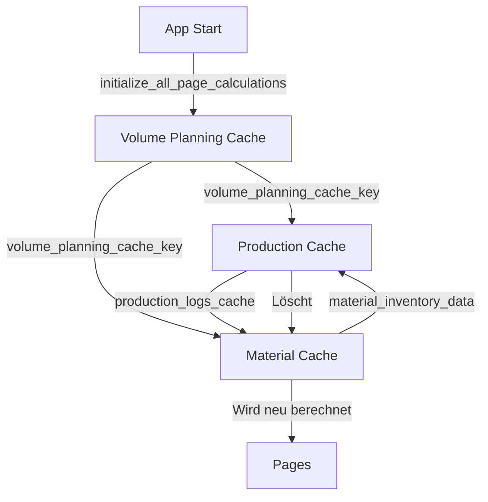
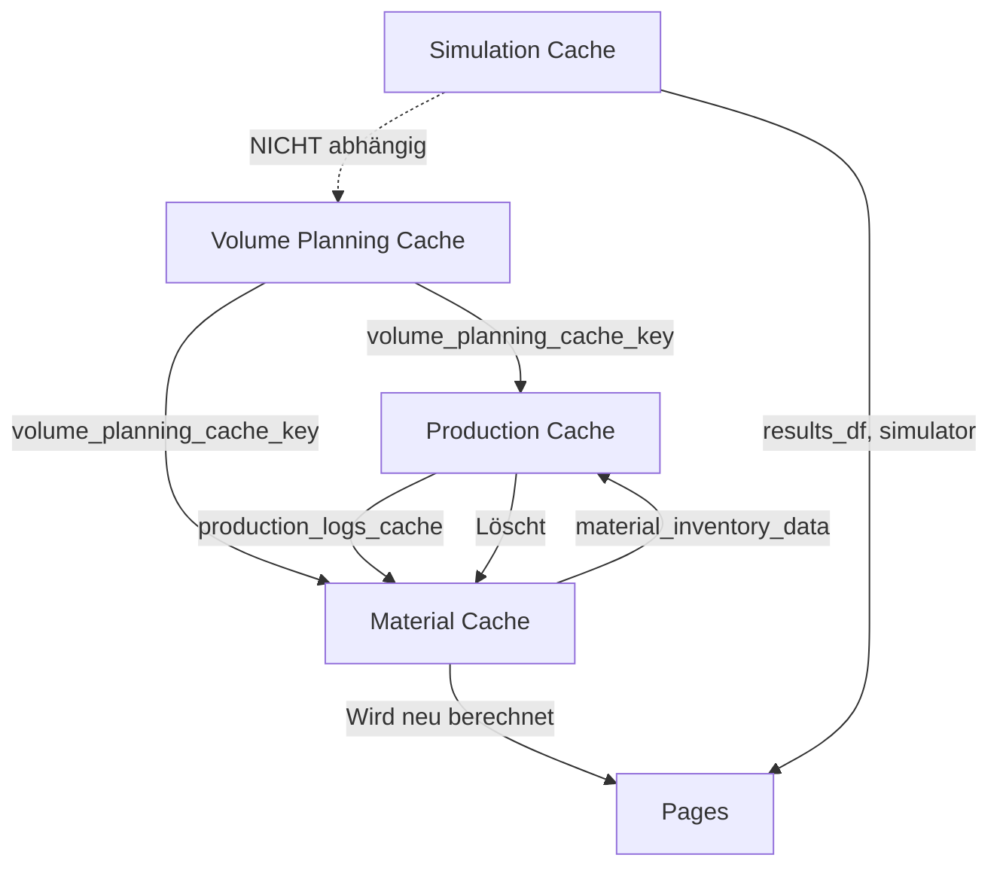

# Caching-Dokumentation

Detaillierte Dokumentation des Caching-Systems: Funktionsweise, Implementierung und kritische Aspekte für Szenarien.

---

## Übersicht: Caching-Architektur



---

## 1. Volume Planning Cache

### Cache-Key-Generierung

```python
cache_key = (planning_year, yearly_volume, scenario_fingerprint)
```

**Komponenten:**
- `planning_year` - Planungsjahr (Standard: 2027)
- `yearly_volume` - Jahresvolumen (Standard: 370000)
- `scenario_fingerprint` - Fingerprint aller aktiven Szenarien

### Scenario Fingerprint

```python
def _scenario_fingerprint(scenario_manager: ScenarioManager) -> tuple:
    """
    Erzeugt einen stabilen Fingerprint der aktiven Szenarien.
    Wichtig für Cache-Invalidierung: Wenn sich Szenarien ändern, muss neu berechnet werden.
    """
    items = []
    for s in scenario_manager.scenarios:
        if isinstance(s, StandardScenario):
            continue  # Standard-Szenario wird ignoriert
        
        # Basisschlüssel
        base = (
            s.__class__.__name__,
            s.active,
            s.start_day,
            s.end_day,
        )
        
        # Szenario-spezifische Parameter
        if isinstance(s, MarketingCampaignScenario):
            extra = (s.demand_increase_factor,)
        elif isinstance(s, WarehouseDamageScenario):
            extra = (s.stock_loss_percentage, s.affected_component)
        # ... weitere Szenarien
        
        items.append(base + extra)
    
    return tuple(sorted(items))  # Stabilisiert Reihenfolge
```

### Cache-Struktur

**Gespeichert in `st.session_state`:**
- `daily_demands_planned` - Dict[day] -> Dict[product] -> demand
- `daily_demands_actual` - Dict[day] -> Dict[product] -> demand
- `volume_planning_cache_key` - Cache-Key
- `volume_planning_calculated` - Flag (True wenn berechnet)

### Cache-Invalidierung

**Wird invalidiert wenn:**
- `planning_year` sich ändert
- `yearly_volume` sich ändert
- `scenario_fingerprint` sich ändert (Szenario aktiviert/deaktiviert, Parameter geändert)

**Kritisch für Szenarien:**
- ✅ Marketing-Szenarien werden im Fingerprint berücksichtigt
- ✅ Änderung von `demand_increase_factor` invalidiert Cache
- ✅ Änderung von Start-/Enddatum invalidiert Cache

---

## 2. Production Cache

### Cache-Key-Generierung

```python
volume_planning_cache_key = st.session_state.get('volume_planning_cache_key', None)
cache_key = f"production_logs_{volume_planning_cache_key}"
```

**Abhängigkeit:**
- Abhängig von `volume_planning_cache_key` (enthält bereits Szenario-Fingerprint)

### Cache-Struktur

**Gespeichert in `st.session_state`:**
- `production_logs_cache` - Dict[product] -> DataFrame
- `production_logs_cache_key` - Cache-Key

**DataFrame-Spalten:**
- Standard-Spalten: `Datum`, `geplante PM`, `tatsächliche PM`, `fertiggestellte PM`, `Backlog`, etc.
- **WICHTIG:** `material_verbrauch` - Explizit gespeicherter Materialverbrauch (Option 4)

### Cache-Invalidierung

**Wird invalidiert wenn:**
- `volume_planning_cache_key` sich ändert (Marketing-Szenarien)
- Cache-Key stimmt nicht überein

**Nach Berechnung:**
- Löscht `material_inventory_data` (erzwingt Neuberechnung)
- Löscht `saddle_logs_cache` (erzwingt Neuberechnung)
- Löscht alle `material_inventory_*` Keys (außer `material_inventory_last_cache_key`)

**Kritisch für Szenarien:**
- ✅ Reagiert auf Marketing-Szenarien (über `volume_planning_cache_key`)
- ✅ Materialverbrauch wird explizit gespeichert (für Materiallager)
- ✅ Cache-Invalidierung nach Berechnung (für Konsistenz)

---

## 3. Material Cache

### Cache-Key-Generierung

```python
volume_planning_cache_key = st.session_state.get('volume_planning_cache_key', None)
simulation_hash = hashlib.md5(simulator_state.encode()).hexdigest()
cache_key = f"material_inventory_{simulation_hash}_{volume_planning_cache_key}"
```

**Komponenten:**
- `simulation_hash` - Hash aus Simulator-Status (für Cache-Invalidierung bei Simulator-Änderungen)
- `volume_planning_cache_key` - Enthält Szenario-Fingerprint

### Cache-Struktur

**Gespeichert in `st.session_state`:**
- `material_inventory_data` - Dict[date] -> Dict[saddle] -> stock_morning
- `saddle_logs_cache` - Dict[saddle] -> DataFrame
- `material_inventory_last_cache_key` - Letzter Cache-Key (für Änderungserkennung)
- `{cache_key}` - Flag (True wenn berechnet)

### Cache-Invalidierung

**Wird invalidiert wenn:**
- `cache_key` sich ändert (Simulator-Status oder Szenarien)
- `last_cache_key != cache_key` (erkannt durch Vergleich)

**Automatische Invalidierung:**
- Wird von `calculate_production_logs()` gelöscht (nach Produktionsberechnung)

**Kritisch für Szenarien:**
- ✅ Reagiert auf Marketing-Szenarien (über `volume_planning_cache_key`)
- ✅ Wird automatisch invalidiert wenn Produktion sich ändert
- ✅ Liest `material_verbrauch` aus `production_logs_cache` (Option 4)

---

## 4. Simulation Cache

### Cache-Struktur

```python
simulation_cache = {
    year: {
        'results_df': DataFrame,
        'kpis': Dict,
        'simulator': Simulator
    }
}
```

**Gespeichert in `st.session_state`:**
- `simulation_cache` - Dict[year] -> Dict mit Simulationsergebnissen

### Cache-Invalidierung

**Wird invalidiert wenn:**
- `planning_year` sich ändert
- Manueller Neustart (Button in app.py)

**Kritisch für Szenarien:**
- ⚠️ Cache ist **NICHT** abhängig von Szenarien
- ⚠️ Simulation wird nur einmal pro Jahr gecacht
- ⚠️ Szenarien werden zur Laufzeit angewendet (nicht in Simulation)

---

## Cache-Abhängigkeitsgraph



**Legende:**
- `-->` = Abhängigkeit
- `-.->` = Keine direkte Abhängigkeit

---

## Warum ist Caching so implementiert?

### 1. Performance-Optimierung

**Problem ohne Cache:**
- Jede Page würde bei jedem Rendering alle Berechnungen neu ausführen
- `calculate_volume_planning_demand()` würde 365 Tage × 8 Produkte = 2920 Berechnungen pro Rendering
- `calculate_production_logs()` würde komplexe Rang-Logik für alle Tage neu berechnen

**Lösung mit Cache:**
- Berechnungen werden einmalig durchgeführt
- Cache wird nur invalidiert wenn sich Inputs ändern
- Deutliche Performance-Verbesserung

### 2. Szenario-Reaktivität

**Problem ohne Szenario-Fingerprint:**
- Marketing-Szenarien würden keine Auswirkung haben
- Cache würde nicht invalidiert werden
- Pages würden veraltete Daten anzeigen

**Lösung mit Szenario-Fingerprint:**
- Cache-Key enthält Fingerprint aller aktiven Szenarien
- Änderung von Szenarien → Cache-Key ändert sich → Neuberechnung
- Alle Pages reagieren automatisch auf Szenario-Änderungen

### 3. Zirkuläre Abhängigkeit

**Problem:**
- Produktion benötigt Materialbestand
- Materiallager benötigt Produktionsmenge
- Zirkuläre Abhängigkeit

**Lösung:**
- Iterative Berechnung (2 Iterationen)
- Cache-Invalidierung nach Produktionsberechnung
- Materiallager wird neu berechnet mit aktualisierten Produktionsdaten

---

## Kritische Aspekte für Szenarien

### ✅ Was funktioniert

1. **Marketing-Szenarien:**
   - Werden im `scenario_fingerprint` berücksichtigt
   - Invalidiert `volume_planning_cache_key`
   - Führt zu Neuberechnung von Production und Material

2. **Cache-Invalidierung:**
   - Automatisch nach Produktionsberechnung
   - Materiallager wird neu berechnet
   - Konsistenz wird gewährleistet

3. **Materialverbrauch:**
   - Wird explizit in `production_logs_cache` gespeichert
   - Materiallager liest `material_verbrauch` (Option 4)
   - Konsistenz zwischen Produktion und Materiallager

### ⚠️ Was kritisch ist

1. **Simulation Cache:**
   - **NICHT** abhängig von Szenarien
   - Wird nur einmal pro Jahr gecacht
   - Szenarien werden zur Laufzeit angewendet (nicht in Simulation)
   - **Kritisch:** Wenn Szenarien die Simulation selbst beeinflussen sollten, muss Cache erweitert werden

2. **Cache-Key-Komplexität:**
   - Viele verschiedene Cache-Keys
   - Inkonsistente Invalidierung könnte zu Problemen führen
   - **Kritisch:** Alle Cache-Keys müssen Szenarien berücksichtigen

3. **Zirkuläre Abhängigkeit:**
   - Wird durch 2 Iterationen gelöst
   - **Kritisch:** Mehr Iterationen könnten nötig sein für komplexe Szenarien
   - **Kritisch:** Timing-Probleme könnten auftreten

---

## Implementierungs-Details

### Volume Planning Cache

```python
# Cache-Key-Generierung
cache_key = (planning_year, yearly_volume, scenario_fingerprint)

# Cache-Prüfung
if st.session_state.get('volume_planning_calculated', False) and cached_key == cache_key:
    # Cache-Hit: Verwende gecachte Daten
    return daily_demands_planned, daily_demands_actual

# Cache-Miss: Berechne neu
# ... Berechnung ...
st.session_state.volume_planning_cache_key = cache_key
```

### Production Cache

```python
# Cache-Key-Generierung
volume_planning_cache_key = st.session_state.get('volume_planning_cache_key', None)
cache_key = f"production_logs_{volume_planning_cache_key}"

# Cache-Prüfung
if cache_key in st.session_state and 'production_logs_cache' in st.session_state:
    cached_key = st.session_state.get('production_logs_cache_key', None)
    if cached_key == cache_key:
        return st.session_state.production_logs_cache

# Cache-Miss: Berechne neu
# ... Berechnung ...
st.session_state.production_logs_cache_key = cache_key

# Cache-Invalidierung (nach Berechnung)
if 'material_inventory_data' in st.session_state:
    del st.session_state['material_inventory_data']
```

### Material Cache

```python
# Cache-Key-Generierung
volume_planning_cache_key = st.session_state.get('volume_planning_cache_key', None)
simulation_hash = hashlib.md5(simulator_state.encode()).hexdigest()
cache_key = f"material_inventory_{simulation_hash}_{volume_planning_cache_key}"

# Cache-Änderungserkennung
last_cache_key = st.session_state.get('material_inventory_last_cache_key', None)
if last_cache_key is not None and last_cache_key != cache_key:
    # Cache-Key hat sich geändert → lösche alten Cache
    if 'saddle_logs_cache' in st.session_state:
        del st.session_state.saddle_logs_cache

# Cache-Prüfung
if cache_key not in st.session_state or 'saddle_logs_cache' not in st.session_state:
    # Cache-Miss: Berechne neu
    # ... Berechnung ...
    st.session_state[cache_key] = True
    st.session_state.material_inventory_last_cache_key = cache_key
```

---

## Was NICHT verändert werden sollte

### 1. Scenario Fingerprint

**Kritisch:** Der `scenario_fingerprint` muss **alle** Szenario-Parameter enthalten, die die Berechnung beeinflussen.

**Warum:**
- Wenn Parameter fehlen, wird Cache nicht invalidiert
- Pages zeigen veraltete Daten
- Szenarien haben keine Auswirkung

**Was nicht ändern:**
- Struktur des Fingerprints
- Parameter, die im Fingerprint enthalten sind
- Reihenfolge-Stabilisierung (`sorted()`)

### 2. Cache-Invalidierung nach Produktionsberechnung

**Kritisch:** `calculate_production_logs()` muss Material-Cache löschen.

**Warum:**
- Produktion ändert sich → Material muss neu berechnet werden
- Ohne Invalidierung: Materiallager zeigt veraltete Daten
- Inkonsistenz zwischen Produktion und Materiallager

**Was nicht ändern:**
- Löschen von `material_inventory_data`
- Löschen von `saddle_logs_cache`
- Löschen von `material_inventory_*` Keys

### 3. Materialverbrauch-Spalte

**Kritisch:** `material_verbrauch` muss in `production_logs_cache` gespeichert werden.

**Warum:**
- Materiallager liest `material_verbrauch` (Option 4)
- Ohne diese Spalte: Fallback auf `tatsächliche PM` (könnte inkonsistent sein)
- Explizite Speicherung gewährleistet Konsistenz

**Was nicht ändern:**
- Spalte `material_verbrauch` in `production_logs_cache`
- Logik zum Setzen von `material_verbrauch`
- Fallback-Logik in Materiallager

### 4. Iterative Berechnung

**Kritisch:** 2 Iterationen für zirkuläre Abhängigkeit.

**Warum:**
- Produktion benötigt Materialbestand
- Materiallager benötigt Produktionsmenge
- 2 Iterationen lösen die Abhängigkeit

**Was nicht ändern:**
- Anzahl der Iterationen (2)
- Reihenfolge: Production → Material → Production → Material
- Logik zur Prüfung ob `material_inventory_data` verfügbar ist

---

## Szenario-Integration

### Marketing-Szenarien

**Cache-Key-Änderung:**
- `scenario_fingerprint` ändert sich
- `volume_planning_cache_key` ändert sich
- `production_logs_cache_key` ändert sich
- `material_inventory_cache_key` ändert sich

**Ergebnis:**
- ✅ Alle Caches werden invalidiert
- ✅ Neuberechnung mit Marketing-Effekt
- ✅ Alle Pages reagieren korrekt

### Andere Szenarien (Wasserschaden, Lieferantenausfall, etc.)

**Aktuell:**
- Werden in Simulation verarbeitet
- Beeinflussen `results_df` und `simulator`
- **NICHT** im Cache-Key (nur Marketing)

**Kritisch:**
- ⚠️ Wenn andere Szenarien die Berechnung beeinflussen sollten, müssen sie im Cache-Key berücksichtigt werden
- ⚠️ Aktuell: Nur Marketing-Szenarien invalidiert Cache

---

## Best Practices

### 1. Cache-Key immer erweitern

**Richtig:**
```python
volume_planning_cache_key = st.session_state.get('volume_planning_cache_key', None)
cache_key = f"production_logs_{volume_planning_cache_key}"
```

**Falsch:**
```python
cache_key = "production_logs_static"  # Reagiert nicht auf Szenarien
```

### 2. Cache immer prüfen

**Richtig:**
```python
if cache_key in st.session_state and cached_key == cache_key:
    return cached_data
```

**Falsch:**
```python
if 'data' in st.session_state:
    return st.session_state.data  # Prüft nicht Cache-Key
```

### 3. Cache nach Änderungen invalidierten

**Richtig:**
```python
# Nach Produktionsberechnung
if 'material_inventory_data' in st.session_state:
    del st.session_state['material_inventory_data']
```

**Falsch:**
```python
# Cache wird nicht invalidiert → veraltete Daten
```

---

## Zusammenfassung

**Caching-System:**
- ✅ Performance-optimiert
- ✅ Szenario-reaktiv (Marketing)
- ✅ Konsistent (zirkuläre Abhängigkeit gelöst)
- ✅ Expliziter Materialverbrauch (Option 4)

**Kritisch für Szenarien:**
- ✅ Marketing-Szenarien funktionieren korrekt
- ⚠️ Andere Szenarien könnten Cache-Key-Erweiterung benötigen
- ✅ Cache-Invalidierung funktioniert korrekt
- ✅ Materialverbrauch wird explizit gespeichert

**Was nicht ändern:**
- Scenario Fingerprint-Struktur
- Cache-Invalidierung nach Produktionsberechnung
- Materialverbrauch-Spalte
- Iterative Berechnung (2 Iterationen)
