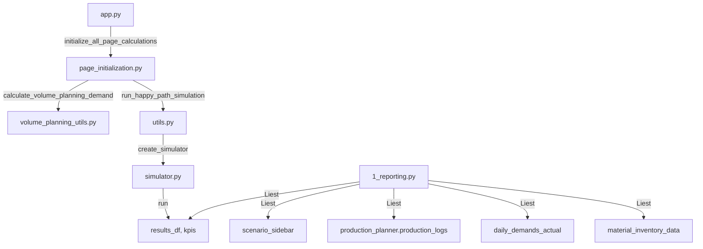
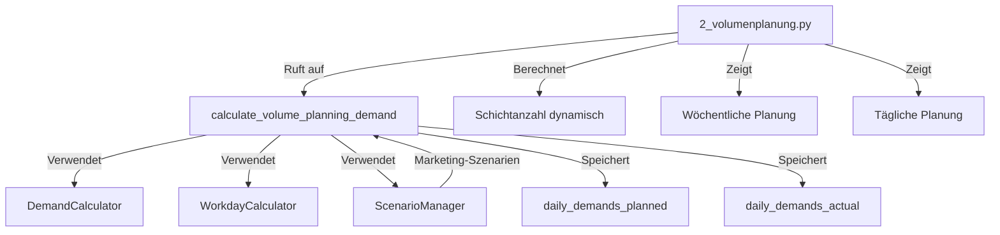
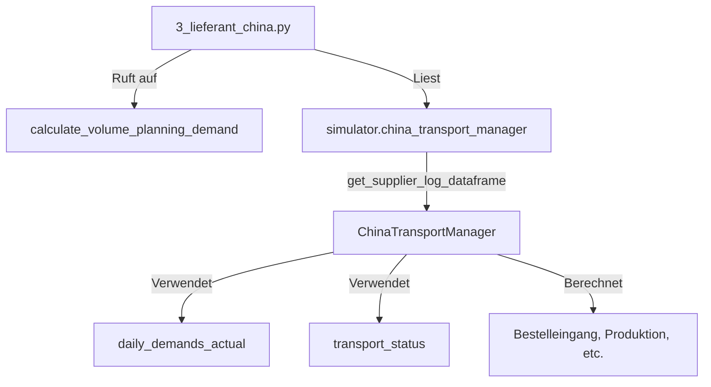
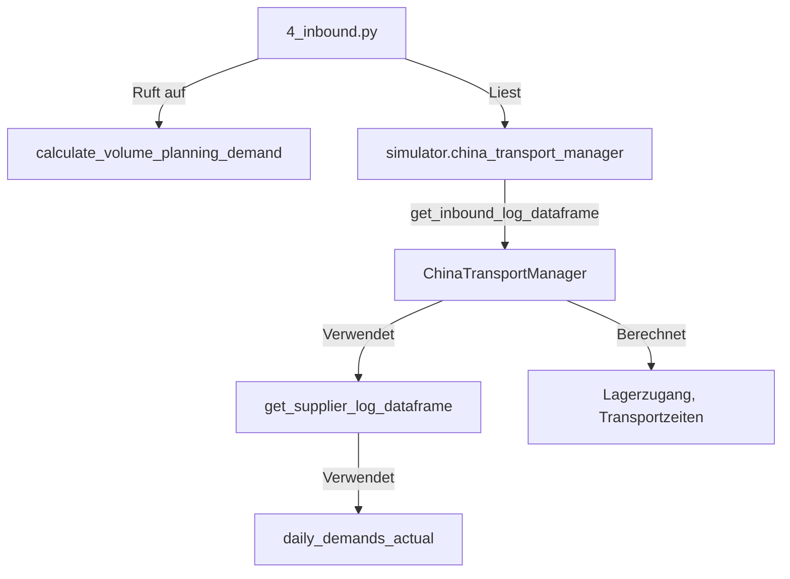
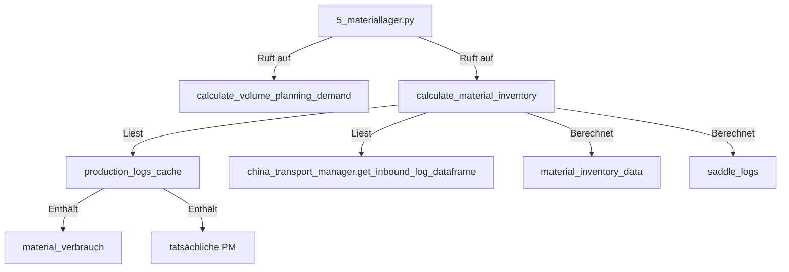
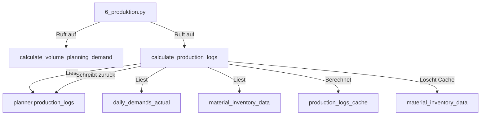
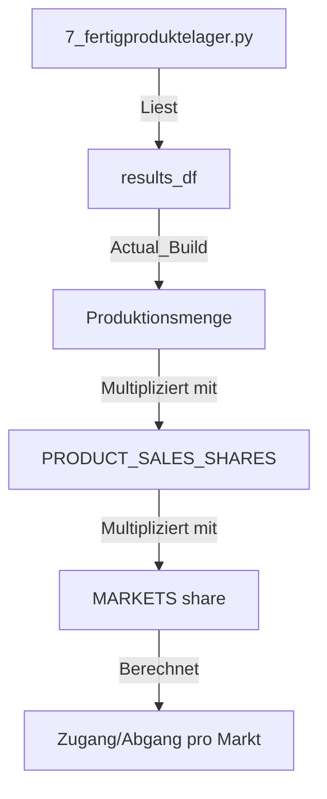
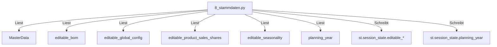
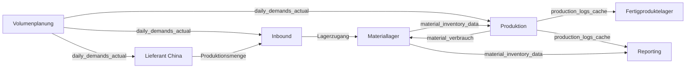

# Pages-Dokumentation

Detaillierte Dokumentation aller Streamlit-Seiten mit Datenfluss, Komponenten-Interaktionen und Berechnungen.

---

## 📊 Page 1: Reporting (`pages/1_reporting.py`)

### Komponenten-Interaktionen

### Datenfluss

**Inputs:**
- `st.session_state.results_df` - Simulationsergebnisse (von `simulator.run()`)
- `st.session_state.kpis` - KPIs (Service Level, etc.)
- `st.session_state.simulator` - Simulator-Instanz
- `st.session_state.daily_demands_actual` - Tägliche Nachfrage (mit Marketing)
- `st.session_state.material_inventory_data` - Materialbestände
- `planner.production_logs` - Produktionslogs (statisch)

**Berechnungen in der Page:**
1. **KPI-Dashboard Produktion:**
   - Service Level aus `kpis` oder berechnet aus `results_df`
   - Gesamtnachfrage: Summe `Daily_Target`
   - Gesamtproduktion: Summe `Actual_Build`

2. **KPI-Dashboard Materiallager:**
   - Bestand morgens/abends aus `material_inventory_data`
   - Lagerzugang/Lagerabgang aus `material_inventory_data`

3. **SCOR-Metriken:**
   - Perfect Order Fulfillment: Berechnet aus `china_transport_manager.transport_status`
   - Source Cycle Time: Berechnet aus `transport_status`
   - Produktionsmetriken: Berechnet aus `production_logs` und `daily_demands_actual`

**Outputs:**
- Anzeige von KPIs (Service Level, Gesamtnachfrage, Gesamtproduktion)
- Anzeige von Materiallager-KPIs
- Anzeige von SCOR-Metriken (Perfect Order Fulfillment, Source Cycle Time, Produktionsmetriken)

### Tabellen/Spalten-Datenquellen

| Spalte/Tabelle | Datenquelle | Berechnung |
|----------------|-------------|------------|
| Service Level | `kpis['service_level']` oder `results_df` | `(total_produced / total_demand * 100)` |
| Gesamtnachfrage | `kpis['total_demand']` oder `results_df['Daily_Target'].sum()` | Summe über alle Tage |
| Gesamtproduktion | `kpis['total_produced']` oder `results_df['Actual_Build'].sum()` | Summe über alle Tage |
| Materiallager KPIs | `material_inventory_data` | Aggregiert über alle Tage |
| Perfect Order Fulfillment | `china_transport_manager.transport_status` | Analysiert alle Transporte |
| Source Cycle Time | `china_transport_manager.transport_status` | Berechnet Lieferzeiten |
| Produktionsmetriken | `production_logs` + `daily_demands_actual` | Aggregiert über alle Tage |

---

## 📅 Page 2: Volumenplanung (`pages/2_volumenplanung.py`)

### Komponenten-Interaktionen

### Datenfluss

**Inputs:**
- `st.session_state.planning_year` - Planungsjahr (Standard: 2027)
- `st.session_state.yearly_volume` - Jahresvolumen (Standard: 370000)
- `st.session_state.scenario_manager` - Szenario-Manager (für Marketing)
- `MasterData.SEASONALITY` - Saisonalitätsfaktoren
- `MasterData.PRODUCT_SALES_SHARES` - Verkaufsanteile pro Produkt
- `MasterData.DAILY_WORKLOAD` - Arbeitslast pro Wochentag

**Berechnungen in der Page:**
1. **Nachfrageberechnung:**
   - `calculate_volume_planning_demand()` wird aufgerufen
   - Berechnet `daily_demands_planned` (ohne Marketing) und `daily_demands_actual` (mit Marketing)
   - Verwendet `DemandCalculator` mit Carry-Over-Logik

2. **Schichtanzahl-Berechnung:**
   - `calculate_shifts_from_demand(daily_target)` - Dynamisch basierend auf Nachfrage
   - Formel: `ceil(daily_target / (8 * 130))` → begrenzt auf 1-3 Schichten

3. **Wöchentliche Planung:**
   - Gruppiert tägliche Daten nach Kalenderwoche
   - Summiert geplanten/tatsächlichen Bedarf pro Woche

4. **Tägliche Planung:**
   - Zeigt alle 365 Tage mit geplantem/tatsächlichem Bedarf pro Produkt

**Outputs:**
- `st.session_state.daily_demands_planned` - Geplante Nachfrage (ohne Marketing)
- `st.session_state.daily_demands_actual` - Tatsächliche Nachfrage (mit Marketing)
- `st.session_state.daily_demand_data` - Nachfrage-Daten für andere Seiten
- Anzeige: Wöchentliche und tägliche Planungstabellen

### Tabellen/Spalten-Datenquellen

| Spalte | Datenquelle | Berechnung |
|--------|-------------|------------|
| Datum | `workday_calc.get_date_from_day(day)` | Konvertiert Tag-Index zu Datum |
| Kalenderwoche | `get_week_number(date)` | ISO-Kalenderwoche |
| Geplanter Bedarf (pro Produkt) | `daily_demands_planned[day][product]` | Von `DemandCalculator` (ohne Marketing) |
| Tatsächlicher Bedarf (pro Produkt) | `daily_demands_actual[day][product]` | Von `DemandCalculator` (mit Marketing) |
| Schichtanzahl | `calculate_shifts_from_demand()` | Dynamisch: `ceil(demand / 1040)` |

---

## 🇨🇳 Page 3: Lieferant China (`pages/3_lieferant_china.py`)

### Komponenten-Interaktionen

### Datenfluss

**Inputs:**
- `st.session_state.simulator.china_transport_manager` - Transport-Manager
- `st.session_state.daily_demands_actual` - Tägliche Nachfrage (mit Marketing)
- `MasterData.calculate_saddle_shares()` - Sattel-Anteile pro Produkt
- `MasterData.CHINA_SUPPLIER` - Lieferanten-Parameter (Lead Time, etc.)

**Berechnungen in der Page:**
1. **Bestelleingang:**
   - Wird in `ChinaTransportManager.get_supplier_log_dataframe()` berechnet
   - Basierend auf `daily_demands_actual` (reagiert auf Marketing)
   - Formel: `Bestelleingang = Summe(Produkt-Nachfrage * Sattel-Anteil)`

2. **Produktionsmenge:**
   - Wird in `ChinaTransportManager` berechnet
   - Basierend auf Bestelleingang und Produktionskapazität

**Outputs:**
- Anzeige: Tabelle pro Sattel-Typ mit:
  - Bestelleingang
  - Freigabedatum
  - Freigegebene Bestellungen
  - Störung
  - Produktionsdatum
  - Produktionsmenge
  - Warenausgang
  - Warenbestand

### Tabellen/Spalten-Datenquellen

| Spalte | Datenquelle | Berechnung |
|--------|-------------|------------|
| Bestelleingang | `daily_demands_actual` | Summe über alle Produkte: `demand * saddle_share` |
| Freigabedatum | `ChinaTransportManager` | Bestelleingang + Verarbeitungszeit |
| Freigegebene Bestellungen | `ChinaTransportManager` | Bestelleingang (wenn keine Störung) |
| Störung | `SupplierBreakdownScenario` | Wenn aktiv und Komponente = Sattel |
| Produktionsdatum | `ChinaTransportManager` | Freigabedatum + Produktionszeit |
| Produktionsmenge | `ChinaTransportManager` | Basierend auf Bestelleingang und Kapazität |
| Warenausgang | `ChinaTransportManager` | Produktionsmenge (wenn versendet) |
| Warenbestand | `ChinaTransportManager` | Kumulativ: Zugang - Ausgang |

---

## 🚢 Page 4: Inbound (`pages/4_inbound.py`)

### Komponenten-Interaktionen

### Datenfluss

**Inputs:**
- `st.session_state.simulator.china_transport_manager` - Transport-Manager
- `st.session_state.daily_demands_actual` - Tägliche Nachfrage (mit Marketing)
- `MasterData.calculate_saddle_shares()` - Sattel-Anteile

**Berechnungen in der Page:**
1. **Lagerzugang:**
   - Wird in `ChinaTransportManager.get_inbound_log_dataframe()` berechnet
   - Basierend auf `get_supplier_log_dataframe()` (Produktionsmenge)
   - Reagiert auf Marketing-Szenarien (über `daily_demands_actual`)

2. **Transportzeiten:**
   - Abfahrt LKW 🇨🇳: Produktionsdatum
   - Ankunft LKW 🇨🇳: Produktionsdatum + LKW-Zeit
   - Abfahrt Schiff 🇨🇳: Ankunft LKW 🇨🇳
   - Ankunft Schiff 🇩🇪: Abfahrt Schiff + Schiffszeit
   - Verfügbar im Lager 🇩🇪: Ankunft LKW 🇩🇪

**Outputs:**
- Anzeige: Tabelle mit Transportzeiten und Lagerzugang pro Sattel-Typ

### Tabellen/Spalten-Datenquellen

| Spalte | Datenquelle | Berechnung |
|--------|-------------|------------|
| Menge Gesamt | `get_supplier_log_dataframe()` | Summe aller Sattel-Typen |
| Sattel-Typ Mengen | `get_supplier_log_dataframe()` | Produktionsmenge pro Sattel-Typ |
| Abfahrt LKW 🇨🇳 | `ChinaTransportManager` | Produktionsdatum |
| Ankunft LKW 🇨🇳 | `ChinaTransportManager` | Abfahrt + LKW-Zeit |
| Abfahrt Schiff 🇨🇳 | `ChinaTransportManager` | Ankunft LKW 🇨🇳 |
| Ankunft Schiff 🇩🇪 | `ChinaTransportManager` | Abfahrt Schiff + Schiffszeit |
| Verfügbar im Lager 🇩🇪 | `ChinaTransportManager` | Ankunft LKW 🇩🇪 |

---

## 📦 Page 5: Materiallager (`pages/5_materiallager.py`)

### Komponenten-Interaktionen

### Datenfluss

**Inputs:**
- `st.session_state.production_logs_cache` - Produktionslogs (mit `material_verbrauch`)
- `st.session_state.simulator.china_transport_manager` - Transport-Manager (für Inbound)
- `st.session_state.daily_demands_actual` - Tägliche Nachfrage (für Cache-Key)

**Berechnungen in der Page:**
1. **Materialinventar-Berechnung:**
   - `calculate_material_inventory()` wird aufgerufen
   - Liest Lagerzugang aus `get_inbound_log_dataframe()`
   - Liest Lagerabgang aus `production_logs_cache` (Spalte `material_verbrauch`)
   - Berechnet Bestand morgens/abends chronologisch

2. **Cache-Management:**
   - Cache-Key: `material_inventory_{simulation_hash}_{volume_planning_cache_key}`
   - Cache wird invalidiert wenn:
     - `volume_planning_cache_key` sich ändert (Marketing-Szenarien)
     - `simulation_hash` sich ändert (Simulator-Status)

**Outputs:**
- `st.session_state.material_inventory_data` - Materialbestände pro Datum und Sattel-Typ
- `st.session_state.saddle_logs_cache` - Sattel-Logs für UI-Anzeige
- Anzeige: Tabelle pro Sattel-Typ mit:
  - Lagerzugang
  - Bestand morgens
  - Lagerabgang
  - Bestand abends

### Tabellen/Spalten-Datenquellen

| Spalte | Datenquelle | Berechnung |
|--------|-------------|------------|
| Lagerzugang | `get_inbound_log_dataframe()` | Verfügbar im Lager 🇩🇪 (pro Sattel-Typ) |
| Bestand morgens | `material_inventory_data[date][saddle]` | Bestand abends gestern + Zugang heute |
| Lagerabgang | `production_logs_cache[product]['material_verbrauch']` | Summe über alle Produkte mit diesem Sattel |
| Bestand abends | `Bestand morgens - Lagerabgang` | Max(0, stock_morning - issue) |

---

## 🏭 Page 6: Produktion (`pages/6_produktion.py`)

### Komponenten-Interaktionen

### Datenfluss

**Inputs:**
- `st.session_state.simulator.production_planner.production_logs` - Statische Produktionslogs
- `st.session_state.daily_demands_actual` - Tägliche Nachfrage (mit Marketing)
- `st.session_state.material_inventory_data` - Materialbestände (für Rang-Logik)
- `MasterData.BOM` - Stückliste (für Sattel-Zuordnung)
- `MasterData.GLOBAL_CONFIG` - Globale Konfiguration (Kapazität, etc.)

**Berechnungen in der Page:**
1. **Produktionslogs-Berechnung:**
   - `calculate_production_logs()` wird aufgerufen
   - Repliziert Rang-Logik aus `ProductionPlanner` mit aktualisierten Inputs
   - Berechnet `tatsächliche PM` basierend auf:
     - `daily_demands_actual` (mit Marketing)
     - Materialbestand (aus `material_inventory_data` mit Delta-Korrektur)
     - Tageskapazität
     - Backlog

2. **Delta-Korrektur:**
   - `cumulative_saddle_consumption_delta` - Kumulierter Mehrverbrauch
   - Korrigiert Materialbestand: `corrected_stock = base_stock - delta`

3. **Fertiggestellte PM:**
   - Wird in zweitem Durchlauf berechnet
   - `fertiggestellte PM[Tag] = tatsächliche PM[Tag-1]` (1-Tag-Verzögerung)

**Outputs:**
- `st.session_state.production_logs_cache` - Aktualisierte Produktionslogs
- `planner.production_logs` - Zurückgeschrieben in Simulator
- Anzeige: Tabelle pro Produkt mit:
  - Geplante PM
  - Tatsächliche PM
  - Fertiggestellte PM
  - Backlog
  - Materialbestand (Sattel)

### Tabellen/Spalten-Datenquellen

| Spalte | Datenquelle | Berechnung |
|--------|-------------|------------|
| Geplante PM | `daily_demands_actual[day][product]` | Nachfrage (mit Marketing) |
| Tatsächliche PM | `_recalculate_all_products_with_rank_logic()` | Rang-Logik mit Materiallimit |
| Fertiggestellte PM | `tatsächliche PM[Tag-1]` | 1-Tag-Verzögerung |
| Backlog | `(geplante PM + Backlog gestern) - tatsächliche PM` | Kumulativ |
| Materialbestand (Sattel) | `material_inventory_data[date][saddle]` | Korrigiert mit Delta |

---

## ✅ Page 7: Fertigproduktelager (`pages/7_fertigproduktelager.py`)

### Komponenten-Interaktionen

### Datenfluss

**Inputs:**
- `st.session_state.results_df` - Simulationsergebnisse
- `MasterData.PRODUCT_SALES_SHARES` - Verkaufsanteile pro Produkt
- `MasterData.MARKETS` - Marktanteile

**Berechnungen in der Page:**
1. **Produktionsmenge pro Produkt:**
   - `production_qty = actual_build * product_share`

2. **Zugang/Abgang pro Markt:**
   - `receipt = production_qty * market_share`
   - `dispatch = receipt` (Just-in-Time, sofort versendet)

3. **Bestand:**
   - Vereinfacht: 0 (Just-in-Time-Produktion)

**Outputs:**
- Anzeige: Tabelle pro Produkt mit:
  - Zugang (pro Markt)
  - Abgang (pro Markt)
  - Bestand morgens/abends (vereinfacht: 0)

### Tabellen/Spalten-Datenquellen

| Spalte | Datenquelle | Berechnung |
|--------|-------------|------------|
| Zugang (pro Markt) | `results_df['Actual_Build']` | `actual_build * product_share * market_share` |
| Abgang (pro Markt) | Gleich wie Zugang | Just-in-Time (sofort versendet) |
| Bestand morgens/abends | Vereinfacht | 0 (Just-in-Time) |

---

## 📋 Page 8: Stammdaten (`pages/8_stammdaten.py`)

### Komponenten-Interaktionen

### Datenfluss

**Inputs:**
- `MasterData.BOM` - Stückliste (wird in `editable_bom` kopiert)
- `MasterData.GLOBAL_CONFIG` - Globale Konfiguration
- `MasterData.PRODUCT_SALES_SHARES` - Verkaufsanteile
- `MasterData.SEASONALITY` - Saisonalität
- `MasterData.MARKETS` - Märkte
- `MasterData.SUPPLIERS` - Lieferanten
- `HolidaysConfig` - Feiertage

**Berechnungen in der Page:**
1. **Editierbare Stammdaten:**
   - Alle Stammdaten werden in `st.session_state.editable_*` kopiert
   - Benutzer kann Werte ändern (über `st.data_editor`)
   - Änderungen werden in `st.session_state` gespeichert

2. **Planungsjahr:**
   - Wird in `st.session_state.planning_year` gespeichert
   - Beeinflusst alle Berechnungen

**Outputs:**
- `st.session_state.editable_bom` - Editierbare Stückliste
- `st.session_state.editable_global_config` - Editierbare globale Konfiguration
- `st.session_state.editable_product_sales_shares` - Editierbare Verkaufsanteile
- `st.session_state.editable_seasonality` - Editierbare Saisonalität
- `st.session_state.planning_year` - Planungsjahr
- Anzeige: Editierbare Tabellen für alle Stammdaten

### Tabellen/Spalten-Datenquellen

| Tabelle | Datenquelle | Editierbar |
|---------|-------------|------------|
| Stückliste | `MasterData.BOM` | Ja (Rahmen, Sattel, Gabel) |
| Planung | `MasterData.GLOBAL_CONFIG` | Ja (Jahresvolumen, Kapazität, etc.) |
| Märkte & Kunden | `MasterData.MARKETS` | Nein (nur Anzeige) |
| Auslieferung | `MasterData.MARKETS` | Nein (nur Anzeige) |
| Beschaffung | `MasterData.SUPPLIERS` | Nein (nur Anzeige) |
| Feiertage | `HolidaysConfig` | Nein (nur Anzeige) |

---

## Zusammenfassung: Datenfluss zwischen Pages

**Kritische Abhängigkeiten:**
1. **Volumenplanung** ist Basis für alle anderen Pages
2. **Produktion** und **Materiallager** haben zirkuläre Abhängigkeit (gelöst durch iterative Berechnung)
3. **Materiallager** liest `material_verbrauch` aus `production_logs_cache`
4. Alle Pages reagieren auf Marketing-Szenarien über `daily_demands_actual`
