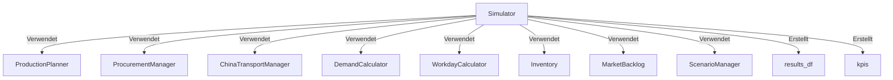
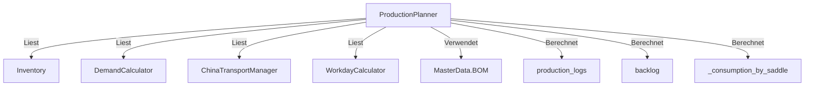
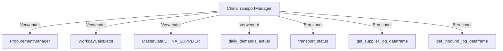
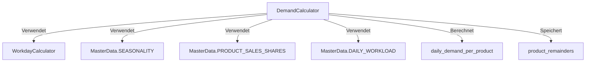
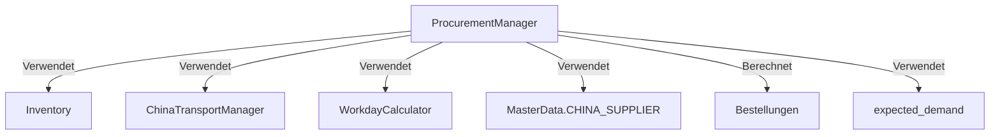
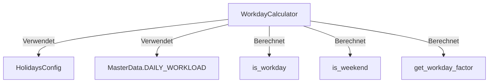
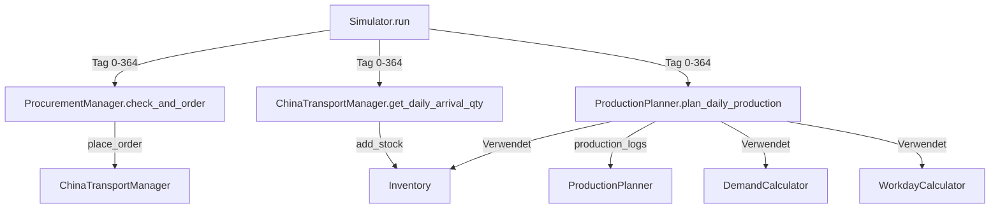

# Simulation-Dokumentation

Detaillierte Dokumentation aller Simulation-Module mit Interaktionen, Berechnungen und Datenflüssen.

---

## 🎯 Simulator (`simulation/simulator.py`)

### Interaktionen



### Was wird berechnet?

1. **Tägliche Simulation (365 Tage):**
   - Verarbeitet Szenarien (Wasserschaden, Lieferantenausfall, etc.)
   - Verarbeitet Wareneingänge (Inbound)
   - Plant Produktion (über `ProductionPlanner`)
   - Verwaltet Bestellungen (über `ProcurementManager`)
   - Aktualisiert Lagerbestände
   - Erstellt `results_df` mit täglichen Metriken

2. **KPIs:**
   - Service Level
   - Tage mit Materialmangel
   - Gesamtnachfrage/Gesamtproduktion

### Inputs/Outputs

**Inputs:**
- `yearly_volume` - Jahresvolumen
- `initial_stock_*` - Anfangsbestände
- `scenario_manager` - Szenario-Manager

**Outputs:**
- `results_df` - DataFrame mit täglichen Metriken
- `kpis` - Dictionary mit KPIs
- `production_planner.production_logs` - Produktionslogs
- `china_transport_manager` - Transport-Manager (für andere Pages)

---

## 🏭 ProductionPlanner (`simulation/production_planner.py`)

### Interaktionen



### Was wird berechnet?

1. **Tägliche Produktionsplanung (`plan_daily_production`):**
   - Produktionsbedarf = Nachfrage + Backlog
   - Anteilige Produktion (proportional zur Nachfrage)
   - Rang-basierte Produktion (Rang 1-4: MIN, Rang 5-8: MIN + Rest)
   - Materiallimit-Prüfung (Sattel-Bestand)
   - Kapazitätslimit-Prüfung

2. **Rang-Logik:**
   - **Rang 1-4:** `MIN(Bedarf, Anteilige, Materiallimit)`
   - **Rang 5-8:** `MIN(Bedarf, Anteilige, Materiallimit) + Rest-Verteilung`
   - Rest-Verteilung: Verwendet verbleibende Kapazität für Produkte mit höchstem Bedarf

3. **Backlog-Berechnung:**
   - `backlog = max(0, (geplante_PM + backlog_gestern) - tatsächliche_PM)`
   - Wird reduziert, wenn Produktion *gestartet* wird (nicht erst bei Fertigstellung)

4. **Materialverbrauch:**
   - Wird während Rang-Logik sofort abgebucht
   - Gespeichert in `_consumption_by_saddle`

### Inputs/Outputs

**Inputs:**
- `day` - Tag (0-basiert)
- `marketing_add_ons` - Marketing-Add-ons pro Produkt
- `inventory.stock_saddles` - Sattel-Bestand
- `demand_calculator` - Nachfrage-Rechner
- `china_transport_manager` - Für Inbound-Bestand

**Outputs:**
- `production_logs[product]` - Liste von Log-Einträgen pro Produkt
- `backlog[product]` - Backlog pro Produkt
- `_consumption_by_saddle[saddle]` - Kumulierter Verbrauch pro Sattel-Typ

### Kritische Logik

**Rang-basierte Produktion:**
```python
# Rang 1-4: MIN(Bedarf, Anteilige, Materiallimit)
if rank <= 4:
    scheduled_qty = min(demand, proportional, minimal)

# Rang 5-8: MIN + Rest-Verteilung
else:
    base_qty = min(demand, proportional, minimal)
    remaining_capacity = daily_capacity - total_scheduled_so_far
    rest_production = min(remaining_capacity, minimal, remaining_demand)
    scheduled_qty = base_qty + rest_production
```

---

## 🇨🇳 ChinaTransportManager (`simulation/china_transport.py`)

### Interaktionen



### Was wird berechnet?

1. **Bestellverwaltung:**
   - `place_order(day, quantity)` - Platziert Bestellung
   - `get_daily_arrival_qty(day)` - Gibt täglichen Wareneingang zurück

2. **Transport-Status:**
   - Verfolgt alle Bestellungen von Bestellung bis Ankunft
   - Berechnet Transportzeiten (LKW, Schiff, etc.)
   - Verarbeitet Szenarien (Lieferprobleme, Maschinenausfall)

3. **Supplier Log:**
   - `get_supplier_log_dataframe(saddle_type, saddle_share)` - Erstellt Tabelle für Lieferant China
   - Berechnet Bestelleingang basierend auf `daily_demands_actual`
   - Berechnet Produktionsmenge basierend auf Bestelleingang

4. **Inbound Log:**
   - `get_inbound_log_dataframe(saddle_shares)` - Erstellt Tabelle für Inbound
   - Verwendet `get_supplier_log_dataframe()` für Produktionsmengen
   - Berechnet Transportzeiten und Verfügbarkeitsdaten

### Inputs/Outputs

**Inputs:**
- `day` - Tag (0-basiert)
- `quantity` - Bestellmenge
- `daily_demands_actual` - Tägliche Nachfrage (für Bestelleingang)
- `saddle_shares` - Sattel-Anteile pro Produkt

**Outputs:**
- `transport_status` - Dictionary mit Transport-Status aller Bestellungen
- `get_supplier_log_dataframe()` - DataFrame für Lieferant China
- `get_inbound_log_dataframe()` - DataFrame für Inbound

---

## 📊 DemandCalculator (`simulation/demand_calculator.py`)

### Interaktionen



### Was wird berechnet?

1. **Tägliche Nachfrage pro Produkt:**
   - `calculate_daily_demand_per_product(day, product, marketing_add_on)`
   - Formel: `ABRUNDEN((Base_Daily_Float + Rest) + Marketing_Add_On)`
   - Rest für nächsten Tag: `(Base + Rest) - ABRUNDEN(Base + Rest)`

2. **Carry-Over-Logik:**
   - Reste werden von Tag zu Tag mitgeführt
   - Am letzten Arbeitstag des Jahres: Alle Reste werden aufsummiert

3. **Monatliche Base_Daily_Float:**
   - Wird bei Monatswechsel neu berechnet
   - Formel: `(yearly_volume * monthly_factor * sales_share) / num_workdays`

### Inputs/Outputs

**Inputs:**
- `day` - Tag (0-basiert)
- `product` - Produktname
- `marketing_add_on` - Marketing-Add-on (Float)
- `is_last_workday_of_year` - Flag für Jahresende

**Outputs:**
- `int` - Ganzzahlige Nachfrage
- `product_remainders[product]` - Rest für nächsten Tag (intern)

---

## 📦 ProcurementManager (`simulation/procurement_manager.py`)

### Interaktionen



### Was wird berechnet?

1. **Proaktive Bestelllogik:**
   - `check_and_order(day, expected_demand)`
   - Wenn `expected_demand` übergeben: Bestellt genau diesen Bedarf
   - Bestellt heute für Bedarf in 49 Tagen (Lead Time)

2. **Reaktive Bestelllogik (Fallback):**
   - Verwendet historische Durchschnitte
   - Reorder Point = Durchschnitt * Threshold-Tage
   - Bestellt wenn effektiver Bestand < Reorder Point

3. **Pipeline-Bestand:**
   - Berücksichtigt Ware, die bereits unterwegs ist
   - Verhindert Endlos-Bestellungen

### Inputs/Outputs

**Inputs:**
- `day` - Tag (0-basiert)
- `expected_demand` - Erwartete Nachfrage für Zukunftstag (optional)
- `inventory.stock_saddles` - Sattel-Bestand
- `demand_history_*` - Nachfragehistorie (für Fallback)

**Outputs:**
- Ruft `china_transport_manager.place_order()` auf

---

## 📅 WorkdayCalculator (`simulation/workday_calculator.py`)

### Interaktionen



### Was wird berechnet?

1. **Arbeitstag-Prüfung:**
   - `is_workday(day)` - Prüft ob Tag ein Arbeitstag ist
   - Arbeitstage: Montag-Freitag, keine Feiertage

2. **Wochentag-Informationen:**
   - `get_weekday_name(day)` - Wochentag-Name
   - `get_weekday_abbr(day)` - Wochentag-Abkürzung

3. **Arbeitslast-Faktor:**
   - `get_workday_factor(day)` - Faktor aus `DAILY_WORKLOAD`

### Inputs/Outputs

**Inputs:**
- `year` - Jahr
- `day` - Tag (0-basiert)

**Outputs:**
- `bool` - Ist Arbeitstag?
- `str` - Wochentag-Name/Abkürzung
- `float` - Arbeitslast-Faktor

---

## Zusammenfassung: Simulation-Datenfluss



**Kritische Abhängigkeiten:**
1. **ProductionPlanner** benötigt Materialbestand aus **Inventory**
2. **ProcurementManager** benötigt erwartete Nachfrage (Look-Ahead)
3. **ChinaTransportManager** verwaltet alle Transporte zentral
4. Alle Module verwenden **WorkdayCalculator** für Arbeitstag-Prüfung
