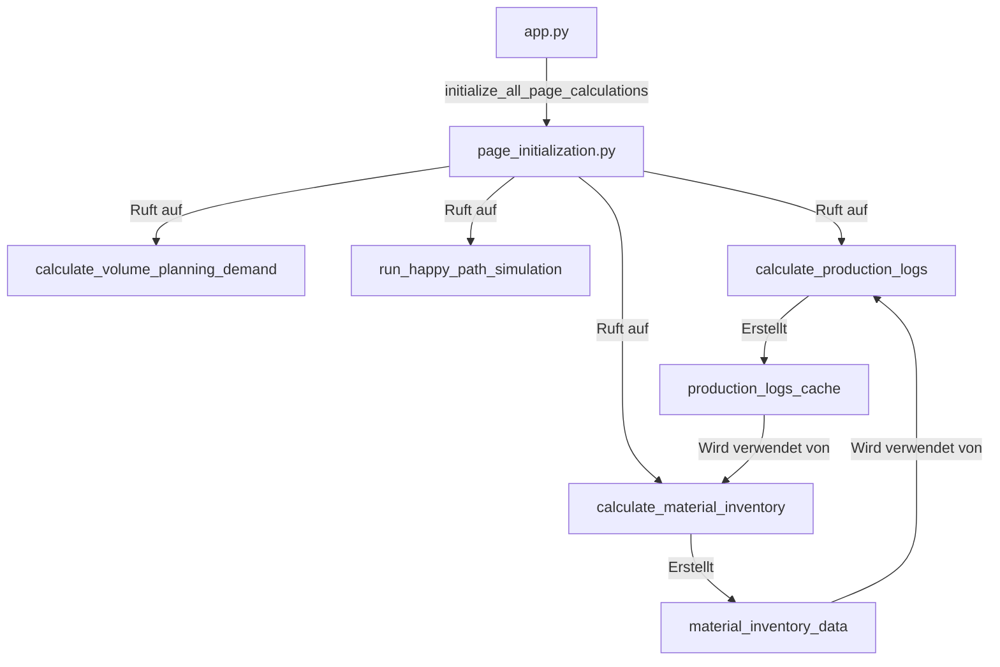
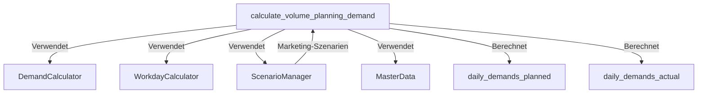
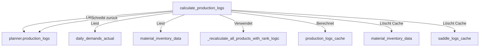
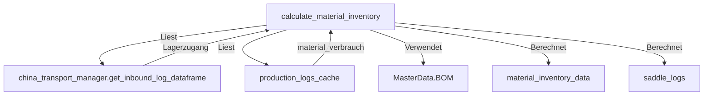
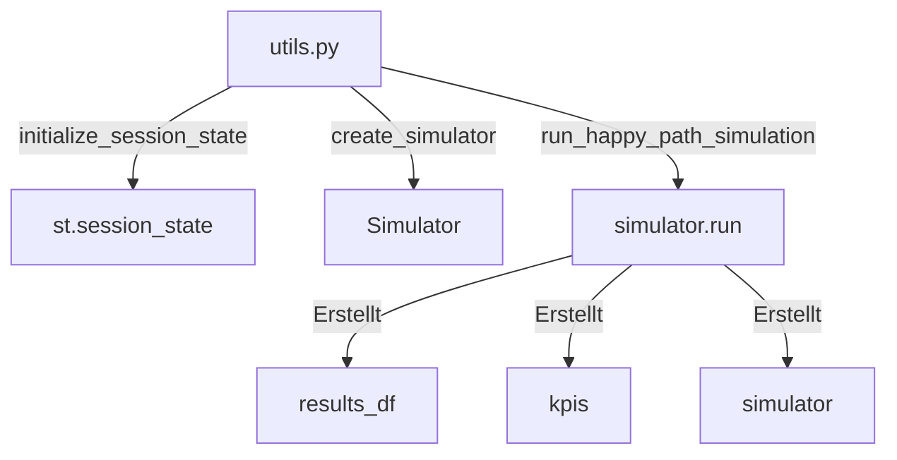
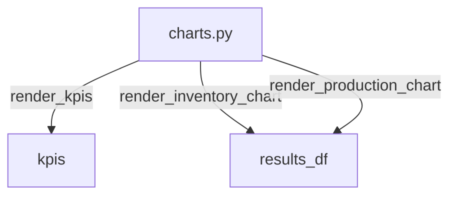
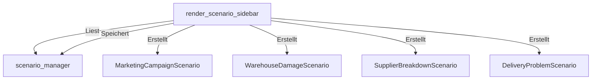
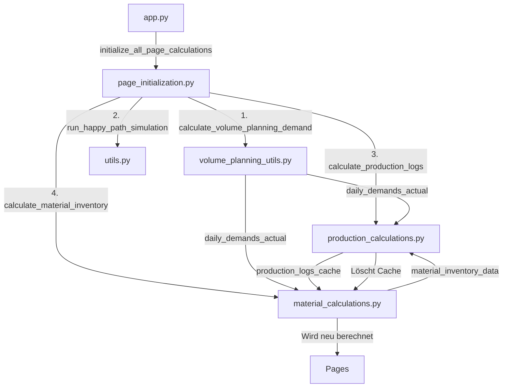

# UI-Dokumentation

Detaillierte Dokumentation aller UI-Module mit Interaktionen, Berechnungen und Datenflüssen.

---

## 🚀 Page Initialization (`ui/page_initialization.py`)

### Interaktionen

### Was wird berechnet?

1. **Initialisierungsreihenfolge:**
   - Schritt 1: `calculate_volume_planning_demand()` - Basis für alle anderen
   - Schritt 2: `run_happy_path_simulation()` - Erstellt Simulator
   - Schritt 3: Iterative Berechnung (2 Iterationen):
     - Iteration 1: Produktion mit statischen Werten → Materiallager
     - Iteration 2: Produktion mit korrigierten Materialwerten → Materiallager

2. **Zweck:**
   - Stellt sicher, dass alle Caches beim App-Start verfügbar sind
   - Verhindert, dass Seiten erst besucht werden müssen, damit Berechnungen starten

### Inputs/Outputs

**Inputs:**
- `st.session_state` - Session State (wird gelesen und geschrieben)

**Outputs:**
- `st.session_state.daily_demands_planned` - Geplante Nachfrage
- `st.session_state.daily_demands_actual` - Tatsächliche Nachfrage (mit Marketing)
- `st.session_state.production_logs_cache` - Produktionslogs
- `st.session_state.material_inventory_data` - Materialbestände

---

## 📊 Volume Planning Utils (`ui/volume_planning_utils.py`)

### Interaktionen

### Was wird berechnet?

1. **Nachfrageberechnung:**
   - Berechnet Nachfrage für alle 365 Tage
   - Zwei Varianten:
     - `daily_demands_planned` - Ohne Marketing
     - `daily_demands_actual` - Mit Marketing

2. **Marketing-Integration:**
   - Liest aktive Marketing-Szenarien aus `ScenarioManager`
   - Berechnet Marketing-Add-ons pro Produkt
   - Addiert Marketing-Add-ons zur Basis-Nachfrage

3. **Jahressummen-Korrektur:**
   - Korrigiert Summe pro Produkt auf exakt `yearly_volume * sales_share`
   - Wird nur für `daily_demands_planned` angewendet (nicht für `daily_demands_actual`)

4. **Cache-Management:**
   - Cache-Key: `(planning_year, yearly_volume, scenario_fingerprint)`
   - `scenario_fingerprint` - Fingerprint aller aktiven Szenarien
   - Cache wird invalidiert wenn sich Szenarien ändern

### Inputs/Outputs

**Inputs:**
- `st.session_state.planning_year` - Planungsjahr
- `st.session_state.yearly_volume` - Jahresvolumen
- `st.session_state.scenario_manager` - Szenario-Manager

**Outputs:**
- `st.session_state.daily_demands_planned` - Geplante Nachfrage (365 Tage)
- `st.session_state.daily_demands_actual` - Tatsächliche Nachfrage (365 Tage)
- `st.session_state.volume_planning_cache_key` - Cache-Key

---

## 🏭 Production Calculations (`ui/production_calculations.py`)

### Interaktionen

### Was wird berechnet?

1. **Dynamische Produktionsberechnung:**
   - Repliziert Rang-Logik aus `ProductionPlanner` mit aktualisierten Inputs
   - Verwendet `daily_demands_actual` (mit Marketing) statt statischer Nachfrage
   - Verwendet `material_inventory_data` (korrigiert) statt statischem Bestand

2. **Delta-Korrektur:**
   - `cumulative_saddle_consumption_delta` - Kumulierter Mehrverbrauch
   - Korrigiert Materialbestand: `corrected_stock = base_stock - delta`
   - Verhindert, dass mehr Material verbraucht wird als vorhanden

3. **Backlog-Berechnung:**
   - `new_backlog = max(0, (planned_pm + prev_backlog) - actual_started)`
   - Backlog wird reduziert, wenn Produktion *gestartet* wird

4. **Materialverbrauch:**
   - Speichert `material_verbrauch` explizit in `production_logs_cache`
   - Wird von Materiallager verwendet (Option 4: Hybrid-Ansatz)

5. **Fertiggestellte PM:**
   - Wird in zweitem Durchlauf berechnet
   - `fertiggestellte PM[Tag] = tatsächliche PM[Tag-1]` (1-Tag-Verzögerung)
   - Wird auf 0 gesetzt an Wochenenden/Feiertagen

### Inputs/Outputs

**Inputs:**
- `st.session_state.simulator.production_planner.production_logs` - Statische Logs
- `st.session_state.daily_demands_actual` - Tägliche Nachfrage (mit Marketing)
- `st.session_state.material_inventory_data` - Materialbestände
- `st.session_state.volume_planning_cache_key` - Cache-Key (für Szenarien)

**Outputs:**
- `st.session_state.production_logs_cache` - Aktualisierte Produktionslogs
- `planner.production_logs` - Zurückgeschrieben in Simulator
- Löscht `material_inventory_data` und `saddle_logs_cache` (Cache-Invalidierung)

---

## 📦 Material Calculations (`ui/material_calculations.py`)

### Interaktionen

### Was wird berechnet?

1. **Materialinventar-Berechnung:**
   - Berechnet Bestand morgens/abends chronologisch (Tag für Tag)
   - Bestand morgens = Bestand abends gestern + Zugang heute
   - Bestand abends = Bestand morgens - Lagerabgang

2. **Lagerabgang:**
   - Liest `material_verbrauch` aus `production_logs_cache` (Option 4)
   - Fallback auf `tatsächliche PM` wenn `material_verbrauch` nicht vorhanden
   - Summiert über alle Produkte mit gleichem Sattel-Typ

3. **Chronologische Berechnung:**
   - Verarbeitet Tage in chronologischer Reihenfolge
   - Bestand wird Tag für Tag fortgeschrieben

### Inputs/Outputs

**Inputs:**
- `st.session_state.simulator.china_transport_manager` - Transport-Manager (für Inbound)
- `st.session_state.production_logs_cache` - Produktionslogs (mit `material_verbrauch`)

**Outputs:**
- `st.session_state.material_inventory_data` - Materialbestände pro Datum und Sattel-Typ
- `saddle_logs` - Sattel-Logs für UI-Anzeige (wird nicht im session_state gespeichert)

---

## 🛠️ Utils (`ui/utils.py`)

### Interaktionen

### Was wird berechnet?

1. **Session State Initialisierung:**
   - `initialize_session_state()` - Initialisiert alle Session State Variablen
   - Setzt Standardwerte für alle benötigten Variablen

2. **Simulator-Erstellung:**
   - `create_simulator()` - Erstellt Simulator-Instanz
   - Verwendet Parameter aus `st.session_state`

3. **Happy Path Simulation:**
   - `run_happy_path_simulation()` - Führt Simulation aus
   - Prüft Cache für aktuelles Jahr
   - Speichert Ergebnisse in `simulation_cache[year]`

### Inputs/Outputs

**Inputs:**
- `st.session_state.yearly_volume` - Jahresvolumen
- `st.session_state.planning_year` - Planungsjahr
- `st.session_state.scenario_manager` - Szenario-Manager

**Outputs:**
- `st.session_state.results_df` - Simulationsergebnisse
- `st.session_state.kpis` - KPIs
- `st.session_state.simulator` - Simulator-Instanz
- `st.session_state.simulation_cache` - Cache für Simulationen pro Jahr

---

## 📊 Charts (`ui/charts.py`)

### Interaktionen

### Was wird berechnet?

1. **KPI-Rendering:**
   - `render_kpis(kpis)` - Zeigt KPIs an
   - Service Level, Tage gestoppt, etc.

2. **Chart-Rendering:**
   - `render_inventory_chart(results_df)` - Lagerbestands-Chart
   - `render_production_chart(results_df)` - Produktions-Chart

### Inputs/Outputs

**Inputs:**
- `kpis` - Dictionary mit KPIs
- `results_df` - DataFrame mit Simulationsergebnissen

**Outputs:**
- Streamlit-Widgets (Charts, Metrics)

---

## 🎭 Scenario Sidebar (`ui/scenario_sidebar.py`)

### Interaktionen

### Was wird berechnet?

1. **Szenario-Management:**
   - Rendert Sidebar für Szenario-Verwaltung
   - Erlaubt Hinzufügen/Entfernen von Szenarien
   - Zeigt aktive Szenarien an

2. **Szenario-Erstellung:**
   - Marketingaktion: Faktor, Start-/Enddatum
   - Wasserschaden: Verlustprozentsatz, Komponente
   - Maschinenausfall: Komponente
   - Lieferprobleme: Verlustprozentsatz, Verzögerung, Komponente

### Inputs/Outputs

**Inputs:**
- `st.session_state.scenario_manager` - Szenario-Manager
- Benutzer-Eingaben (über Streamlit-Widgets)

**Outputs:**
- `st.session_state.scenario_manager` - Aktualisierter Szenario-Manager
- Streamlit-Widgets (Sidebar)

---

## Zusammenfassung: UI-Datenfluss

**Kritische Abhängigkeiten:**
1. **Volume Planning** muss zuerst berechnet werden (Basis für alle anderen)
2. **Production** und **Material** haben zirkuläre Abhängigkeit (gelöst durch 2 Iterationen)
3. **Production** löscht Material-Cache nach Berechnung (Cache-Invalidierung)
4. Alle Module verwenden **ScenarioManager** für Szenario-Integration
