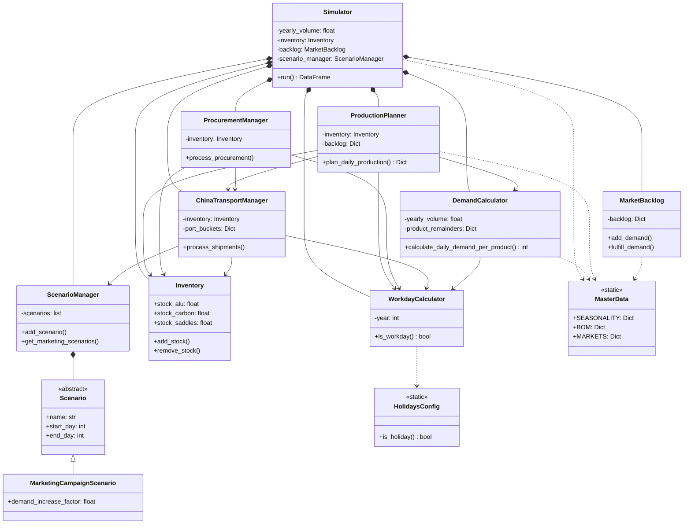

# UML-Diagramm - Anleitung und Verwendung

## Übersicht

Dieses Projekt enthält ein umfassendes UML-Klassendiagramm, das alle Klassen, ihre Beziehungen und Abhängigkeiten visualisiert.

## Dateien

- **`UML_DIAGRAMM.puml`**: PlantUML-Datei (vollständiges Diagramm)
- **`UML_DIAGRAMM_ANLEITUNG.md`**: Diese Datei

## PlantUML (Empfohlen)

### Was ist PlantUML?

PlantUML ist eine textbasierte Sprache zur Erstellung von UML-Diagrammen. Vorteile:
- ✅ Textbasiert (gut für Version Control)
- ✅ Kann in Markdown eingebettet werden
- ✅ Sehr mächtig für komplexe Diagramme
- ✅ Viele Tools unterstützen es

### Verwendung

#### Option 1: Online Viewer
1. Gehe zu: http://www.plantuml.com/plantuml/uml/
2. Kopiere den Inhalt von `UML_DIAGRAMM.puml`
3. Diagramm wird automatisch generiert
4. Export als PNG, SVG, etc.

#### Option 2: VS Code Extension
1. Installiere Extension: "PlantUML" (von jebbs)
2. Öffne `UML_DIAGRAMM.puml`
3. Drücke `Alt+D` oder Rechtsklick → "Preview PlantUML"
4. Export über Rechtsklick → "Export Current Diagram"

#### Option 3: IntelliJ/PyCharm Plugin
1. Installiere Plugin: "PlantUML integration"
2. Öffne `UML_DIAGRAMM.puml`
3. Rechtsklick → "View Diagram" oder `Ctrl+Alt+U`

#### Option 4: Command Line
```bash
# PlantUML JAR herunterladen
wget http://sourceforge.net/projects/plantuml/files/plantuml.jar/download -O plantuml.jar

# Diagramm generieren
java -jar plantuml.jar UML_DIAGRAMM.puml

# Generiert: UML_DIAGRAMM.png
```

#### Option 4: Python Script (mit plantuml)
```python
# Installation: pip install plantuml
from plantuml import PlantUML

server = PlantUML(url='http://www.plantuml.com/plantuml/img/')
server.processes_file('UML_DIAGRAMM.puml', outfile='UML_DIAGRAMM.png')
```

### In Markdown einbetten

```markdown
```plantuml
@startuml
... PlantUML Code ...
@enduml
```
```

**Unterstützt von:**
- GitLab (nativ)
- GitHub (mit Plugin)
- Confluence (mit Plugin)
- VS Code (mit Extension)
- IntelliJ/PyCharm (mit Plugin)

---

## Mermaid (Alternative für GitHub)

Mermaid wird von GitHub nativ unterstützt. Hier ist eine vereinfachte Version:



**Kopiere diesen Code in eine Markdown-Datei auf GitHub - wird automatisch gerendert!**

---

## Diagramm-Struktur

### Packages (Farbcodiert)

1. **simulation** (Hellblau): Business-Logik
   - Simulator
   - DemandCalculator
   - ProductionPlanner
   - ProcurementManager
   - ChinaTransportManager
   - WorkdayCalculator

2. **models** (Beige): Datenmodelle
   - Inventory
   - MarketBacklog
   - Scenario (und Subklassen)
   - ScenarioManager

3. **config** (Hellgrün): Konfiguration
   - MasterData
   - HolidaysConfig

4. **ui** (Lila): UI-Hilfsfunktionen
   - Utils
   - ScenarioSidebar
   - Charts

5. **pages** (Nicht im UML, aber Teil der Architektur): Streamlit-Seiten
   - app.py (Hauptseite)
   - pages/1_reporting.py
   - pages/2_volumenplanung.py
   - pages/3_lieferant_china.py
   - pages/4_inbound.py
   - pages/5_materiallager.py
   - pages/6_produktion.py
   - pages/7_fertigproduktelager.py
   - pages/8_stammdaten.py

### Beziehungstypen

- **Komposition** (`*--`): Starke Beziehung, Lebensdauer gekoppelt
  - Beispiel: `Simulator *-- Inventory` (Simulator "besitzt" Inventory)

- **Aggregation** (`o--`): Schwächere Beziehung, Lebensdauer unabhängig
  - Nicht verwendet in diesem Diagramm

- **Dependency** (`-->`): Nutzt, aber besitzt nicht
  - Beispiel: `ProductionPlanner --> Inventory`

- **Vererbung** (`<|--`): "erbt von"
  - Beispiel: `Scenario <|-- MarketingCampaignScenario`

- **Assoziation** (`..>`): Nutzt statische Methoden/Konstanten
  - Beispiel: `Simulator ..> MasterData`

---

## Empfohlene Präsentationsreihenfolge

Für Präsentationen, Code-Reviews oder Onboarding empfiehlt sich folgende Reihenfolge:

### Phase 1: Übersicht und Architektur (2-3 Minuten)

In dieser Phase wird zunächst eine Gesamtübersicht über die Architektur gegeben. Das komplette UML-Diagramm wird gezeigt und die grundlegende Struktur erklärt. Die Anwendung besteht aus fünf Packages, die in einer Layered Architecture organisiert sind: Das **config** Package (Konfiguration) bildet die Grundlage, darauf baut das **models** Package (Datenmodelle) auf, gefolgt vom **simulation** Package (Business-Logik), dem **ui** Package (UI-Hilfsfunktionen) und schließlich dem **pages** Package (Streamlit-Seiten für die Benutzeroberfläche). Jedes Package ist farbcodiert, um die visuelle Unterscheidung zu erleichtern. Die Architektur folgt dem Prinzip "von unten nach oben", wobei die unteren Schichten die Grundlage für die oberen bilden.

### Phase 2: Configuration Layer - Die Grundlage (3-4 Minuten)

Diese Phase beginnt mit dem **Configuration Layer**, da diese Klassen die statische Grundlage für die gesamte Anwendung bilden. Zuerst wird die **MasterData** Klasse aus dem config Package (grün) erklärt. Diese Klasse ist eine statische Klasse, die alle zentralen Stammdaten enthält, wie Saisonalität, Bill of Materials (BOM), Marktverteilung, Verkaufsanteile und globale Konfiguration. Sie wird von fast allen anderen Klassen genutzt, ohne dass eine Instanziierung notwendig ist. Die Beziehungen `Simulator ..> MasterData` und `DemandCalculator ..> MasterData` zeigen, wie diese Klasse als zentrale Datenquelle dient.

Anschließend wird die **HolidaysConfig** Klasse erklärt, die ebenfalls zum config Package gehört. Diese Klasse verwaltet Feiertage für verschiedene Länder (Deutschland, China, USA, etc.) und nutzt die externe `holidays`-Bibliothek. Sie stellt statische Methoden bereit, um zu prüfen, ob ein bestimmtes Datum ein Feiertag ist. Die Beziehung `WorkdayCalculator ..> HolidaysConfig` zeigt, wie der WorkdayCalculator diese Konfiguration nutzt, um Arbeitstage korrekt zu berechnen.

Diese Klassen werden zuerst erklärt, weil sie die Grundlage bilden, auf der alle anderen Komponenten aufbauen. Sie enthalten keine Business-Logik, sondern nur statische Daten und Konfigurationen.

### Phase 3: Models Layer - Die Datenstrukturen (5-6 Minuten)

In dieser Phase werden die Datenmodelle erklärt, die von der Business-Logik genutzt werden. Diese Klassen repräsentieren die zentralen Datenstrukturen der Anwendung.

Zuerst wird die **Inventory** Klasse aus dem models Package (beige) vorgestellt. Diese Klasse verwaltet die Lagerbestände für alle Komponenten: Aluminium-Rahmen, Carbon-Rahmen und Sättel. Sie ist als Dataclass implementiert und bietet einfache CRUD-Operationen (Create, Read, Update, Delete) für die Bestandsverwaltung. Die Komposition `Simulator *-- Inventory` zeigt, dass der Simulator die Inventory-Instanz besitzt und ihre Lebensdauer kontrolliert. Diese Klasse ist zentral für die gesamte Simulation, da alle Komponenten-Bewegungen über sie laufen.

Als nächstes wird die **MarketBacklog** Klasse erklärt, die ebenfalls zum models Package gehört. Diese Klasse verwaltet den Kunden-Backlog, also unerfüllte Nachfrage, die noch ausgeliefert werden muss. Sie ist markt-spezifisch organisiert (Deutschland, USA, Frankreich, etc.) und berücksichtigt Transitzeiten für die Auslieferung. Zusätzlich verfolgt sie Bestellungen, die sich "in Transit" befinden, also auf dem Weg zum Kunden sind. Die Komposition `Simulator *-- MarketBacklog` zeigt, dass der Simulator diese Instanz besitzt und verwaltet.

Danach wird die **Scenario-Hierarchie** erklärt, die ebenfalls zum models Package gehört. Die Basisklasse **Scenario** ist eine abstrakte Dataclass, die gemeinsame Attribute wie Name, Start- und Endtag sowie einen aktiven Status definiert. Von dieser Basisklasse erben fünf konkrete Szenario-Klassen: **MarketingCampaignScenario** erhöht die Nachfrage um einen Faktor, **WarehouseDamageScenario** simuliert Wasserschäden im Lager, **SupplierBreakdownScenario** simuliert Maschinenausfälle beim Lieferanten, **DeliveryProblemScenario** simuliert Lieferprobleme mit Verlusten oder Verspätungen, und **StandardScenario** repräsentiert den Normalbetrieb ohne Probleme. Die Vererbungsbeziehungen `Scenario <|-- MarketingCampaignScenario` (und ähnlich für die anderen) zeigen diese Hierarchie.

Abschließend wird der **ScenarioManager** erklärt, der alle Szenarien verwaltet. Diese Klasse hält eine Liste aller aktiven Szenarien und bietet Methoden, um für einen bestimmten Tag die relevanten Szenarien abzurufen. Sie ermöglicht eine zeit-basierte Aktivierung von Szenarien, sodass verschiedene Szenarien zu verschiedenen Zeiten aktiv sein können. Die Kompositionen `Simulator *-- ScenarioManager` und `ScenarioManager *-- Scenario` zeigen, dass der Simulator den ScenarioManager besitzt und dieser wiederum die Szenarien verwaltet.

Diese Klassen werden nach dem Configuration Layer erklärt, weil sie die Datenstrukturen sind, die von der Business-Logik genutzt werden. Sie enthalten keine komplexe Logik, sondern repräsentieren den Zustand der Anwendung.

### Phase 4: Simulation Layer - Die Business-Logik (10-12 Minuten)

Diese Phase erklärt die Business-Logik der Anwendung, wobei die Reihenfolge den Abhängigkeiten folgt: von den grundlegenden Hilfsklassen bis zum Haupt-Orchestrator.

Die Präsentation beginnt mit dem **WorkdayCalculator** aus dem simulation Package (blau). Diese Klasse ist die Basis für alle zeit-basierten Berechnungen in der Anwendung. Sie berechnet, ob ein bestimmter Tag ein Arbeitstag ist, indem sie sowohl Wochenenden als auch Feiertage berücksichtigt. Die Klasse nutzt die HolidaysConfig, um länder-spezifische Feiertage zu berücksichtigen (Deutschland für die Produktion, China für den Transport). Die Assoziation `WorkdayCalculator ..> HolidaysConfig` zeigt diese Abhängigkeit. Diese Klasse ist wichtig, weil sie von fast allen anderen Simulation-Klassen genutzt wird, um zeit-basierte Berechnungen korrekt durchzuführen.

Als nächstes wird der **DemandCalculator** erklärt, der ebenfalls zum simulation Package gehört. Diese Klasse berechnet die tägliche Nachfrage für jedes Produkt basierend auf Saisonalität, Verkaufsanteilen und einer speziellen Carry-Over-Logik. Die Carry-Over-Logik stellt sicher, dass Reste vom vorherigen Tag zum nächsten Tag übertragen werden, um eine präzise Ganzzahl-Produktion zu gewährleisten. Die Klasse berechnet zunächst eine monatliche Base-Daily-Float, die dann durch die Anzahl der Arbeitstage im Monat geteilt wird. Marketing-Add-ons werden nach der Rundung addiert, um die Nachfrage zu erhöhen. Die Dependencies `DemandCalculator --> WorkdayCalculator` und `DemandCalculator ..> MasterData` zeigen, dass diese Klasse sowohl den WorkdayCalculator für Arbeitstagsberechnungen als auch MasterData für Stammdaten nutzt. Diese Klasse ist wichtig, weil sie die Nachfrage berechnet, die die gesamte Simulation antreibt.

Danach wird der **ChinaTransportManager** vorgestellt, der die komplexe Transport-Logistik von China nach Deutschland simuliert. Diese Klasse verwaltet den gesamten Prozess: Produktion in China (5 chinesische Arbeitstage), Transport zum Hafen, Verschiffung (nur wenn Losgröße erreicht), Transportzeit per Schiff, und Ankunft in Deutschland (deutsche Arbeitstage). Die Klasse verwendet Port-Buckets, um Bestände im Hafen zwischenzulagern, bevor sie verschifft werden. Die Dependencies `ChinaTransportManager --> Inventory`, `ChinaTransportManager --> WorkdayCalculator` und `ChinaTransportManager --> ScenarioManager` zeigen, dass diese Klasse den Inventory aktualisiert, Arbeitstage für beide Länder berechnet und Szenarien für Störungen berücksichtigt. Diese Klasse ist wichtig, weil sie das Inventory mit Komponenten versorgt, die für die Produktion benötigt werden.

Anschließend wird der **ProductionPlanner** erklärt, der die Produktionsplanung durchführt. Diese Klasse plant die tägliche Produktion basierend auf einer Bottleneck-Logik, die berücksichtigt, welche Komponenten verfügbar sind. Sie priorisiert Produkte mit höherem Backlog, um unerfüllte Nachfrage zu reduzieren. Die Kapazitätsberechnung berücksichtigt Schichten (1-3), Stunden pro Schicht (8) und Kapazität pro Stunde (130). Die Dependencies `ProductionPlanner --> Inventory`, `ProductionPlanner --> DemandCalculator`, `ProductionPlanner --> WorkdayCalculator` und `ProductionPlanner --> ChinaTransportManager` zeigen, dass diese Klasse alle vorherigen Komponenten nutzt: Inventory für verfügbare Komponenten, DemandCalculator für Nachfrage, WorkdayCalculator für Arbeitstage und ChinaTransportManager für Inbound-Daten. Diese Klasse ist wichtig, weil sie die Produktion plant, die das Herzstück der Simulation ist.

Danach wird der **ProcurementManager** erklärt, der die Beschaffung von Komponenten verwaltet. Diese Klasse erstellt Bestellungen beim chinesischen Lieferanten basierend auf dem Bedarf. Sie nutzt den ChinaTransportManager, um Bestellungen zu platzieren, und aktualisiert das Inventory, wenn Lieferungen ankommen. Die Dependencies `ProcurementManager --> Inventory`, `ProcurementManager --> ChinaTransportManager` und `ProcurementManager --> WorkdayCalculator` zeigen diese Abhängigkeiten. Diese Klasse ist wichtig, weil sie den Bedarf mit der Beschaffung verbindet und sicherstellt, dass genügend Komponenten verfügbar sind.

Abschließend wird der **Simulator** als Haupt-Orchestrator erklärt. Diese Klasse koordiniert alle Komponenten und führt die 365-Tage-Simulation aus. Sie initialisiert alle Komponenten in der richtigen Reihenfolge, platziert initiale Bestellungen 49 Tage vor Simulationsbeginn, führt eine Warm-Up-Phase für die Logistik durch und setzt den Initialbestand aus der Inbound-Tabelle. Während der Simulation ruft sie täglich alle Manager und Planner auf, um den kompletten Ablauf zu simulieren. Am Ende berechnet sie alle SCOR-Metriken (Supply Chain Operations Reference). Die Kompositionen `Simulator *-- Inventory`, `Simulator *-- MarketBacklog`, `Simulator *-- ScenarioManager`, etc. zeigen, dass der Simulator alle Komponenten besitzt. Die Dependencies zeigen, wie der Simulator alle anderen Klassen nutzt. Diese Klasse ist wichtig, weil sie die zentrale Klasse ist, die alles zusammenführt und die gesamte Simulation orchestriert.

Die Reihenfolge folgt den Abhängigkeiten: WorkdayCalculator (Basis) → DemandCalculator (nutzt WorkdayCalculator) → ChinaTransportManager (nutzt WorkdayCalculator) → ProductionPlanner (nutzt alle vorherigen) → ProcurementManager (nutzt mehrere) → Simulator (nutzt alles).

### Phase 5: UI Layer - Die Präsentation (2-3 Minuten)

In dieser Phase werden die UI-Hilfsfunktionen erklärt, die die Verbindung zwischen der Business-Logik und der Benutzeroberfläche herstellen.

Zuerst wird die **Utils** Klasse aus dem ui Package (lila) erklärt. Diese Klasse enthält zentrale Utility-Funktionen, die von allen Streamlit-Seiten genutzt werden. Die wichtigste Funktion ist `create_simulator()`, die eine Simulator-Instanz mit Standard-Parametern erstellt. Zusätzlich verwaltet diese Klasse den Session State, der in Streamlit verwendet wird, um Daten zwischen Seitenaufrufen zu speichern. Die Assoziationen `Utils ..> Simulator` und `Utils ..> ScenarioManager` zeigen, dass diese Klasse sowohl den Simulator als auch den ScenarioManager nutzt, um die Anwendung zu initialisieren.

Als nächstes wird die **ScenarioSidebar** Klasse erklärt, die ebenfalls zum ui Package gehört. Diese Klasse rendert die Sidebar in der Streamlit-Anwendung, die es dem Benutzer ermöglicht, Szenarien zu verwalten. Sie bietet eine Benutzeroberfläche zum Hinzufügen und Entfernen von Marketing- und Störungs-Szenarien. Die Assoziation `ScenarioSidebar ..> ScenarioManager` zeigt, dass diese Klasse den ScenarioManager nutzt, um Szenarien zu verwalten.

Schließlich wird die **Charts** Klasse erwähnt, die wiederverwendbare Chart-Hilfsfunktionen bereitstellt. Diese Klasse enthält vordefinierte Chart-Konfigurationen, die in verschiedenen Seiten verwendet werden können, um eine einheitliche Visualisierung zu gewährleisten.

Diese Klassen werden zuletzt erklärt, weil sie die Präsentationsschicht bilden. Sie nutzen die Business-Logik, sind aber nicht Teil der Kern-Logik der Simulation. Sie dienen lediglich dazu, die Ergebnisse der Simulation zu visualisieren und dem Benutzer Interaktionen zu ermöglichen.

### Phase 6: Zusammenfassung und Datenfluss (3-4 Minuten)

In dieser abschließenden Phase wird der gesamte Datenfluss der Simulation zusammengefasst und die wichtigsten Beziehungen hervorgehoben.

Zuerst wird der **gesamte Datenfluss** erklärt, der während einer Simulation abläuft. Der Prozess beginnt damit, dass der **Simulator** alle Komponenten initialisiert: Inventory, MarketBacklog, ScenarioManager, WorkdayCalculator, DemandCalculator, ChinaTransportManager, ProductionPlanner und ProcurementManager. Anschließend platziert der Simulator initiale Bestellungen 49 Tage vor Simulationsbeginn und führt eine Warm-Up-Phase durch, damit Schiffe bereits im Dezember abfahren können. Während der 365-Tage-Simulation wird für jeden Tag folgender Ablauf durchgeführt: Der **DemandCalculator** berechnet die Nachfrage für alle Produkte basierend auf Saisonalität, Verkaufsanteilen und Carry-Over-Logik. Der **ProductionPlanner** plant dann die Produktion basierend auf verfügbaren Komponenten und Nachfrage. Der **ProcurementManager** beschafft neue Komponenten, indem er Bestellungen beim chinesischen Lieferanten platziert. Der **ChinaTransportManager** liefert Komponenten, die bereits bestellt wurden und jetzt ankommen. Das **Inventory** verwaltet die Bestände, indem es eingehende Lieferungen hinzufügt und ausgehende Produktion abzieht. Schließlich verwaltet der **MarketBacklog** den Kunden-Backlog, indem er unerfüllte Nachfrage verfolgt und erfüllte Bestellungen als "in Transit" markiert.

Anschließend werden die **wichtigen Beziehungen** hervorgehoben. Die Komposition zeigt, dass der Simulator alle Komponenten "besitzt" - das bedeutet, dass die Lebensdauer dieser Komponenten an die Lebensdauer des Simulators gekoppelt ist. Die Dependency-Beziehungen zeigen, dass Klassen wie ProductionPlanner mehrere Services "nutzen", ohne sie zu besitzen - das bedeutet, dass diese Services von außen übergeben werden und ihre Lebensdauer unabhängig ist. Die Vererbung in der Scenario-Hierarchie zeigt, wie verschiedene Szenario-Typen von einer gemeinsamen Basisklasse erben und dadurch Polymorphismus ermöglichen. Die Assoziation-Beziehungen zeigen, wie Klassen statische Methoden und Konstanten von MasterData nutzen, ohne dass eine Instanziierung notwendig ist.

Diese Zusammenfassung hilft dem Publikum, das große Ganze zu verstehen und wie alle Komponenten zusammenarbeiten, um eine vollständige Supply Chain Simulation durchzuführen.

### Zeitplan für verschiedene Szenarien

**Kurze Präsentation (10-15 Minuten):**
- Phase 1 (Übersicht) → Phase 4.13 (Simulator) → Phase 6 (Zusammenfassung)

**Mittlere Präsentation (20-25 Minuten):**
- Phase 1 → Phase 2 → Phase 3 → Phase 4.13 (Simulator) → Phase 6

**Ausführliche Präsentation (30-40 Minuten):**
- Alle Phasen in der oben genannten Reihenfolge

**Code-Review (15-20 Minuten):**
- Phase 1 → Phase 4 (alle Simulation-Klassen) → Phase 6

**Onboarding (45-60 Minuten):**
- Alle Phasen + Code-Beispiele für jede Klasse

### Tipps für die Präsentation

1. **Zoom-Funktion nutzen**: Beginne mit Gesamtübersicht, zoome dann in einzelne Packages
2. **Farben nutzen**: Verweise auf die Farbcodierung der Packages
3. **Beziehungen hervorheben**: Zeige Pfeile und erkläre Beziehungstypen
4. **Interaktiv**: Frage nach Verständnis nach jedem Package
5. **Code-Beispiele**: Zeige relevante Code-Stellen parallel zum Diagramm
6. **Storytelling**: Erzähle die "Geschichte" der Simulation (Nachfrage → Produktion → Beschaffung → Transport)

---

## Export-Optionen

### PlantUML unterstützt:
- PNG (Raster)
- SVG (Vektor, skalierbar)
- PDF
- EPS
- LaTeX
- ASCII Art

### Empfohlene Einstellungen:
```bash
# PNG mit hoher Auflösung
java -jar plantuml.jar -tpng -SDPI=300 UML_DIAGRAMM.puml

# SVG (skalierbar, für Präsentationen)
java -jar plantuml.jar -tsvg UML_DIAGRAMM.puml

# PDF (für Dokumentation)
java -jar plantuml.jar -tpdf UML_DIAGRAMM.puml
```

---

## Anpassungen

### Farben ändern
Bearbeite die `!define`-Anweisungen am Anfang:
```plantuml
!define SIMULATION_COLOR #E1F5FF
!define MODEL_COLOR #FFF4E1
!define CONFIG_COLOR #E8F5E9
!define UI_COLOR #F3E5F5
```

### Klassen hinzufügen
```plantuml
class NeueKlasse {
    +attribute: type
    +method() : return_type
}
```

### Beziehungen hinzufügen
```plantuml
Klasse1 --> Klasse2 : "Beschreibung"
```

---

## Tools und Links

- **PlantUML Online**: http://www.plantuml.com/plantuml/uml/
- **PlantUML Syntax**: https://plantuml.com/class-diagram
- **VS Code Extension**: "PlantUML" von jebbs
- **IntelliJ Plugin**: "PlantUML integration"
- **Mermaid Live Editor**: https://mermaid.live/

---

## Tipps

1. **Für Präsentationen**: Exportiere als SVG oder hochauflösendes PNG
2. **Für Dokumentation**: Nutze PDF oder SVG
3. **Für GitHub**: Nutze Mermaid-Version (wird automatisch gerendert)
4. **Für Code-Reviews**: PlantUML ist textbasiert, Änderungen sind leicht nachvollziehbar

---

**Erstellt am**: 2024
**Version**: 1.0

