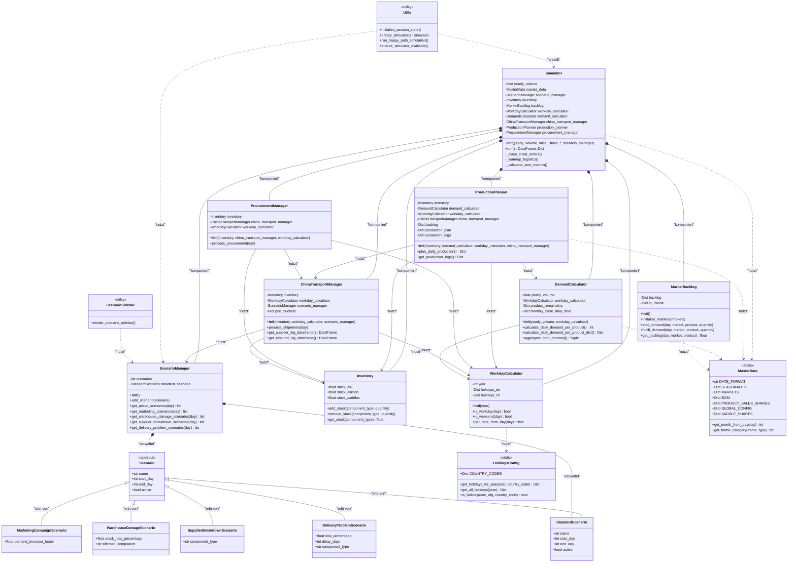

# UML-Klassendiagramm - Mermaid Version

Diese Datei kann direkt auf GitHub angezeigt werden (Mermaid wird nativ unterstützt).

## Legende

- **Komposition** (`*--`): Starke Beziehung, Lebensdauer gekoppelt
- **Dependency** (`-->`): Nutzt, aber besitzt nicht
- **Assoziation** (`..>`): Nutzt statische Methoden/Konstanten
- **Vererbung** (`<|--`): "erbt von"

## Verwendung

1. **Auf GitHub**: Diese Datei wird automatisch als Diagramm gerendert
2. **Lokal**: Nutze Mermaid Live Editor (https://mermaid.live/)
3. **VS Code**: Installiere "Markdown Preview Mermaid Support" Extension

